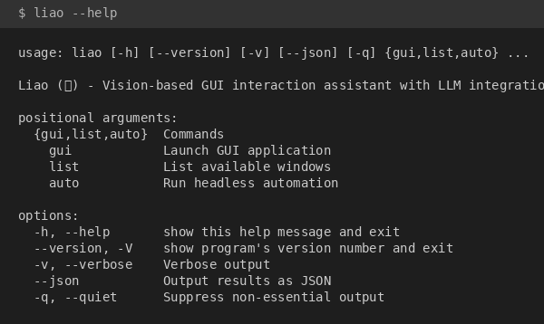

# Liao

Vision-based GUI interaction assistant with LLM integration.

Liao is a Python application that automates desktop chat applications using OCR and large language models. It captures screen content, recognizes conversation text, generates contextual replies, and simulates user input to send messages automatically.

**Supported Platforms:** Windows, Linux (X11/Wayland)

**Supported LLM Backends:** Ollama (local), OpenAI API, Anthropic API, or any OpenAI-compatible endpoint

[中文文档](README_CN.md)

## Features

- **Vision-based Automation**: Uses OCR to read chat messages and detect UI elements
- **Multiple LLM Backends**: Supports Ollama for local inference, OpenAI, Anthropic, and compatible APIs
- **Bilingual Interface**: English and Chinese GUI with runtime language switching
- **Chat App Detection**: Auto-detects WeChat, QQ, Telegram, Slack, Discord, and other applications
- **Area Detection**: Automatic and manual chat/input area detection with visual overlay
- **Reply Gate**: Waits for the other party's reply before generating and sending new messages
- **Cross-platform**: Full support on Windows; Linux support via xdotool and Wayland ScreenCast

## Installation

### Prerequisites

**Python Version:** 3.9 or higher

**LLM Backend:** At least one of the following:
- [Ollama](https://ollama.ai/) running locally (recommended for privacy)
- OpenAI API key
- Anthropic API key
- Any OpenAI-compatible API endpoint

### Windows

```bash
# Install from PyPI
pip install liao

# Or install with OCR support (recommended)
pip install liao[ocr]

# Or install from source
git clone https://github.com/cycleuser/Liao.git
cd Liao
pip install -r requirements.txt
```

### Linux

Linux requires additional system packages for input simulation and screenshot capture.

```bash
# Install system dependencies
sudo apt install xdotool wl-clipboard xclip tesseract-ocr tesseract-ocr-chi-sim gnome-screenshot

# Optional: For Wayland screenshot support (PyGObject method)
sudo apt install gstreamer1.0-plugins-good pipewire python3-gi python3-dbus

# Install Python package
pip install liao

# Or install from source with Linux-specific dependencies
git clone https://github.com/cycleuser/Liao.git
cd Liao
pip install -r requirements-linux.txt
```

**Note:** xdotool works for most chat apps on Wayland since they typically run under XWayland compatibility layer.

### OCR Engine Selection

Liao supports three OCR engines. Install at least one:

| Engine | Install Command | Notes |
|--------|----------------|-------|
| EasyOCR | `pip install easyocr` | Best accuracy, requires PyTorch (~2GB download) |
| RapidOCR | `pip install rapidocr-onnxruntime` | Lightweight, fast, Python <3.13 only |
| pytesseract | `pip install pytesseract` | Universal fallback, requires tesseract binary |

For Linux with pytesseract, install the tesseract binary:
```bash
sudo apt install tesseract-ocr tesseract-ocr-chi-sim tesseract-ocr-eng
```

## Quick Start

### Launch the GUI

```bash
liao
# or
python -m liao
```

### Command Line Interface

```bash
# List available windows
liao list
liao list --chat-only

# Run headless automation
liao auto --title "WeChat" --model llama3 --rounds 5
```

## Usage Guide

### Step 1: Launch and Connect to LLM

Start the application and configure the LLM connection. Enter the API endpoint URL and model name. For Ollama, use `http://localhost:11434`. For cloud APIs, enter your API key.


### Step 2: Configure Language (Optional)

Switch between English and Chinese interface using the language dropdown.


### Step 3: Select Model

Choose an LLM model from the available options. Click "Refresh Models" to update the list.


### Step 4: Select Target Window

Click "Refresh Windows" to list open applications, then double-click to select the target chat window.


### Step 5: Configure Chat Areas

Click "Capture & Detect" to automatically detect the chat and input areas, or manually select regions using the visual overlay.


### Step 6: Start Automation

Enter a system prompt to define the assistant's personality, set the number of conversation rounds, and click "Start Auto Chat" to begin.


## Programmatic Usage

```python
from liao import VisionAgent, LLMClientFactory
from liao.core import WindowManager

# Create LLM client (Ollama local)
llm = LLMClientFactory.create_client(
    provider="ollama",
    base_url="http://localhost:11434",
    model="llama3"
)

# Find target window
wm = WindowManager()
window = wm.find_window_by_title("WeChat")

# Create and run agent
agent = VisionAgent(
    llm_client=llm,
    target_window=window,
    prompt="You are a friendly assistant",
    max_rounds=10,
)

agent.run()
```

## Project Structure

```
Liao/
├── src/liao/
│   ├── __init__.py           # Version and public API
│   ├── api.py                # Public API (VisionAgent)
│   ├── cli.py                # CLI entry point
│   ├── core/                 # Core modules (window, screenshot, input)
│   ├── llm/                  # LLM client implementations
│   ├── agent/                # Agent workflow and chat parsing
│   ├── gui/                  # PySide6 GUI components
│   └── models/               # Data models
├── tests/                    # Unit tests
├── images/                   # Documentation screenshots
├── requirements.txt          # Cross-platform dependencies
├── requirements-linux.txt    # Linux-specific dependencies
└── pyproject.toml            # Package configuration
```

## Development

### Setup Development Environment

```bash
git clone https://github.com/cycleuser/Liao.git
cd Liao
pip install -e ".[all,dev]"
```

### Run Tests

```bash
pytest tests/ -v
```

### Build and Publish

```bash
# Build package
python -m build

# Upload to PyPI
twine upload dist/*
```

## Troubleshooting

### Windows

- **"pywin32 not found"**: Run `pip install pywin32` and restart Python
- **Screenshot capture fails**: Run as administrator if capturing protected windows

### Linux

- **"xdotool not found"**: Install with `sudo apt install xdotool`
- **Input simulation not working**: Ensure xdotool is installed and the target window is an X11 or XWayland window
- **Wayland screenshot fails**: Install GStreamer and PipeWire packages, grant screen capture permission when prompted
- **OCR returns empty results**: Install an OCR engine (`pip install rapidocr-onnxruntime` or `pip install pytesseract`)

## Agent Integration (OpenAI Function Calling)

Liao exposes OpenAI-compatible tools for LLM agents:

```python
from liao.tools import TOOLS, dispatch

response = client.chat.completions.create(
    model="gpt-4o",
    messages=messages,
    tools=TOOLS,
)

result = dispatch(
    tool_call.function.name,
    tool_call.function.arguments,
)
```

## CLI Help



## License

This project is licensed under the GNU General Public License v3.0. See [LICENSE](LICENSE) for details.

## Contributing

Contributions are welcome. Please submit issues and pull requests on GitHub.

## Acknowledgments

- [EasyOCR](https://github.com/JaidedAI/EasyOCR) and [RapidOCR](https://github.com/RapidAI/RapidOCR) for text recognition
- [PySide6](https://doc.qt.io/qtforpython-6/) for the GUI framework
- [Ollama](https://ollama.ai/) for local LLM inference
